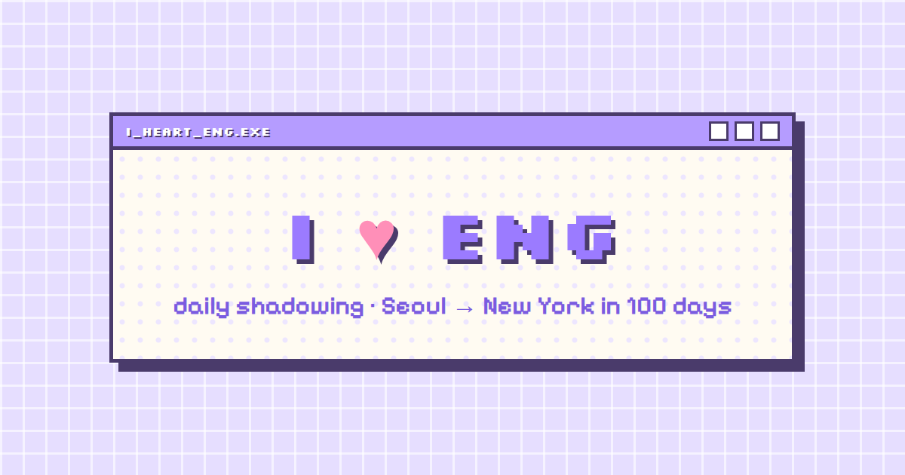
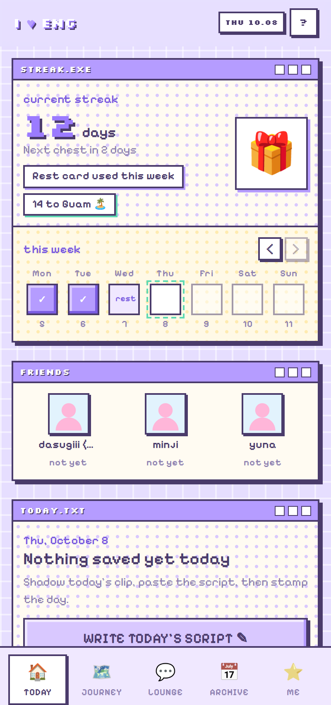
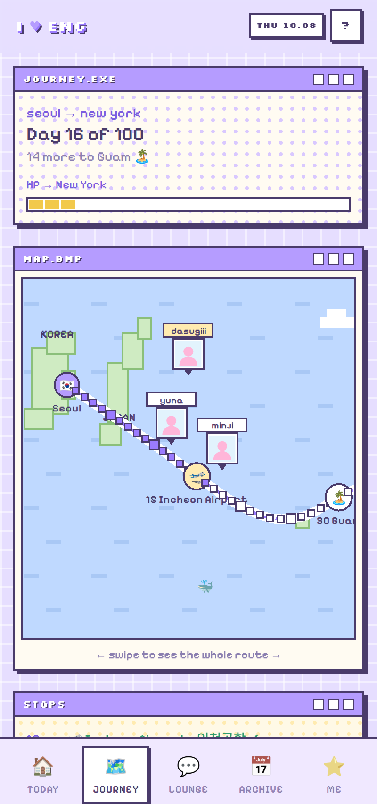
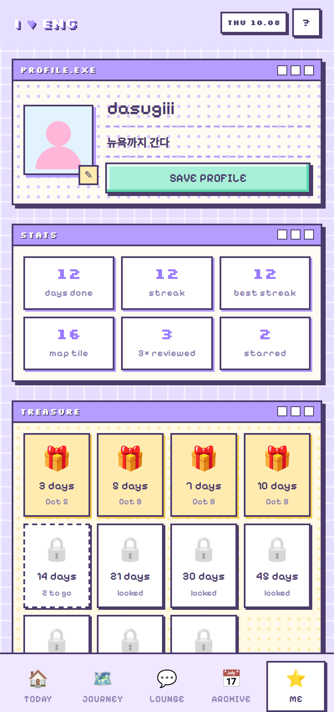

<p align="center"></p>

# I ♥ ENG

**세 친구가 매일 영어 쉐도잉을 하고, 그 기록으로 서울에서 뉴욕까지 지도를 한 칸씩 전진하는 스터디 앱.**
A daily English-shadowing tracker for a 3-person study group — every completed day moves your token one tile closer to New York.

🔗 Live: https://daheui.github.io/i-heart-eng/ (invite-only)

---

## 왜 만들었나

영어 쉐도잉은 효과가 좋지만 혼자서는 3일을 넘기기 어렵다. 유튜브 영상을 고르고, 따라 하고, 다음 날 또 하는 과정에서 "오늘 했는지"를 기록하는 곳도, 꾸준함을 눈으로 확인할 방법도, 같이 하는 친구와 서로 끌어줄 장치도 없었다.

그래서 이 세 가지를 하나로 묶었다.

1. **기록** — 오늘 본 영상 링크(시작 시간 포함), 스크립트, 메모를 하루 단위로 저장
2. **시각화** — 완료한 날짜 수만큼 지도 위 토큰이 서울 → 괌 → 하와이 → LA → 뉴욕으로 이동
3. **동기부여** — 연속일 보물상자, 셋이 같은 날 모두 완료하면 풀하우스 보너스, 안 한 친구 콕 찌르기

## 주요 기능

| 탭 | 내용 |
|---|---|
| **Today** | 연속일(스트릭) · 이번 주 도장 7칸 · 친구들 오늘 완료 여부 · 오늘 스크립트 저장 & 완료 도장 |
| **Journey** | 픽셀 세계지도 위 100칸 항로. 3명 토큰이 함께 표시. 15 인천공항 · 30 괌 · 45 기내식 · 60 하와이 · 70 LA · 80 텍사스 · 100 뉴욕 |
| **Lounge** | 방명록 스타일 채팅 · 사진 · 스티커 · 완료/도착/상자 자동 메시지 · 일요일 밤 주간 결산 |
| **Archive** | 달력 / 목록 / 별표. 지난 기록 열어서 복습 체크 3칸, 지난 날짜 도장 |
| **Me** | 프로필(사진·닉네임·한 줄 다짐) · 통계 · 보물상자 보관함 · 가이드 · 데이터 내보내기 |

**규칙 설계**
- 하루 분량은 자유. "스크립트를 저장하고 완료를 누르면" 1칸 — 영상 길이나 개수를 강제하지 않는다
- 새벽 5시 전까지는 전날로 친다 (자정 넘겨 공부하는 사람을 위해)
- 스트릭은 끊길 수 있지만, 지도 위치는 총 완료일 기준이라 **절대 뒤로 가지 않는다**
- 일주일에 한 번 "쉬어가기 카드"로 하루 빠져도 스트릭 유지
- 보물상자(3·5·7·10·14·21·30·45·60·90·100일)는 한 번 열면 끊겨도 남는다

## 디자인

2000년대 OS 창 UI를 파스텔 라벤더 & 민트로. 창마다 제목 바(`STREAK.EXE`, `TODAY.TXT`), 베벨 버튼, 픽셀 폰트(Silkscreen / Pixelify Sans). 스터디 앱이 "숙제 검사"처럼 느껴지지 않도록 게임 세이브 화면 같은 분위기를 목표로 했다.

<p align="center">
  
</p>

## 기술

- **프론트**: 빌드 도구 없는 정적 HTML / CSS / JavaScript (ES modules), PWA (홈 화면 설치, 서비스 워커)
- **백엔드**: [Supabase](https://supabase.com) — Auth(이메일), Postgres(RLS로 본인 데이터만 수정 가능), Storage(사진·녹음), Realtime(채팅)
- **호스팅**: GitHub Pages
- **비용**: 0원

```
index.html            화면 구조
css/style.css         디자인 토큰 · 픽셀 OS 스타일
js/app.js             상태 · 렌더 · Supabase 연동
js/content.js         온보딩 · 가이드 · 경유지 · 보상 문구
js/config.js          Supabase 주소/키 · 가입 코드
supabase/schema.sql   테이블 · RLS 정책 · 스토리지 버킷
SETUP.md              처음 배포하는 방법 (한국어)
```

## 만든 방식

기획, 공부법 설계, 보상 체계, 화면 구성, 디자인 방향 선택과 세부 결정은 제가 했고, 코드는 Claude와 대화하며 작성했습니다. 세 가지 디자인 시안을 비교해 고르고, 색 조합 네 가지 중 하나를 확정하고, Supabase와 GitHub Pages 배포까지 직접 진행했습니다. 실제 사용자 3명과 운영하며 나오는 피드백을 반영해 계속 고치고 있습니다.

## 다음 단계

- [ ] 녹음 첨부 (기본 비공개, 공개 시 친구가 듣기, 30일 후 자동 삭제)
- [ ] 기록·녹음에 반응 스티커
- [ ] 보물상자 보상으로 토큰 꾸미기 실제 적용
- [ ] 푸시 알림 (오늘 아직 안 했을 때, 콕 찔렸을 때)

## 직접 배포하기

`SETUP.md` 참고. Supabase 무료 프로젝트 하나, GitHub 저장소 하나면 된다.

---

<sub>Made with ♥ by three friends on the way to New York.</sub>
